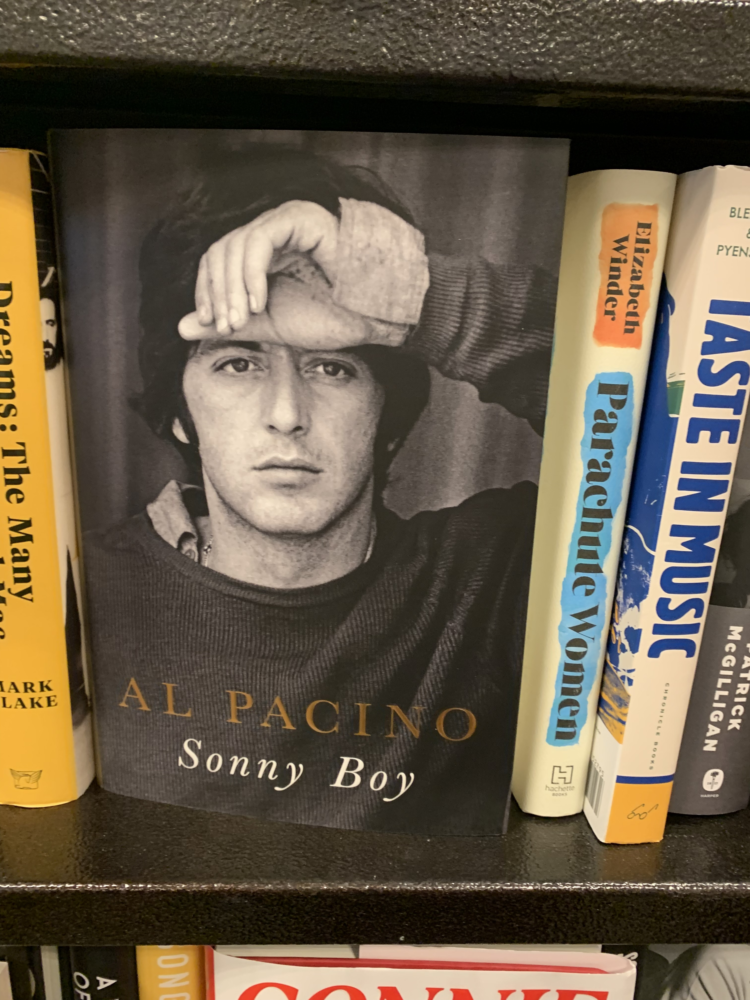

import { YouTube } from '@astro-community/astro-embed-youtube';

<hgroup>
	<h1>Extract structured data from images with DSPy and ax-llm</h1>
	<p>Let's get structured data from an image.</p>
</hgroup>


<div class="pt-6">
<YouTube id="67faupn3G4g" />
</div>


## Image

Here is an example of an image I want to extract structured data from.



## First Attempt

```ts title="image.ts"
import { ai, ax } from "@ax-llm/ax";
import * as fs from "fs";

const llm = ai({
  name: "ollama",
  apiKey: "ollama",
  url: "http://localhost:11434/v1",
  config: { model: "llava:latest" }
	// or any other model that supports "vision"
});

const analyzer = ax(
	`book:image -> description:string "what is in the image"`
);

const imageData = fs.readFileSync("./IMG_5060.jpg").toString("base64");

const result = await analyzer.forward(llm {
	book: { mimeType: 'image/jpeg', data: imageData }
});

console.log(result);
```

And here is the result

```json
{
  description: "The image shows a book on a shelf among other books.
	The book is titled \"SONNY BOY\" by Al Pacino. It appears to be a
	paperback edition of the book, which is likely a biography or memoir
	given the author's name and the title that suggests it might be
	about his life or experiences. The cover of the book features an
	image of Al Pacino, who is known for his role as Sonny Boy in the
	film \"The Godfather.\" The shelf also contains other books with
	various titles and authors, indicating a collection of reading
	materials.",
}
```


This is close to what I want despite some egregious hallucinations (Al Pacino did not play Sonny Boy in The Godfather!), but what I really want is the title and author in a structured format.

## DSPy to the rescue
```ts title="image.ts" del={12-14} ins={15}
import { ai, ax } from "@ax-llm/ax";
import * as fs from "fs";

const llm = ai({
  name: "ollama",
  apiKey: "ollama",
  url: "http://localhost:11434/v1",
  config: { model: "llava:latest" }
	// or any other model that supports "vision"
});

const analyzer = ax(
	`book:image -> description:string "what is in the image"`
);
const analyzer = ax(`book:image -> title:string, author:string`);

const imageData = fs.readFileSync("./IMG_5060.jpg").toString("base64");

const result = await analyzer.forward(llm {
	book: { mimeType: 'image/jpeg', data: imageData }
});

console.log(result);
```

And here is the result

```json
{
  title: "Sonny Boy",
  author: "Al Pacino",
}
```


## Output of the DSPy prompt


```
[ SYSTEM ]
You will be provided with the following fields: `Book`. Your task
is to generate new fields: `Title`, `Author`.

## Input Fields
Book: (A string field)

## Output Fields
Title: (This string field must be included)
Author: (This string field must be included)

## Strict Output Formatting Rules
- No formatting rules should override these
  **Strict Output Formatting Rules**
- Output must strictly follow the defined
  plain-text `field name: value` field format.
- Output field, values must strictly adhere
  to the specified output field formatting rules.
- Do not include fields with empty, unknown,
  or placeholder values.
- Do not add any text before or after the
  output fields, just the field name and value.
- Do not use code blocks.
```
