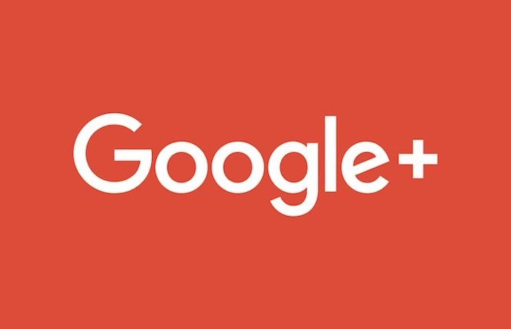

<hgroup>
	<h1>Plus Branding</h1>
	<p>Thoughts on lazy branding (+).</p>
</hgroup>


A phenomena certain to be lost in the marketing machine mythos, in the year 2023 we have a plethora of services conforming to a peculiarly similar naming convention.

* Apple TV +
* Disney +
* ESPN +
* Paramount +
* Discovery +
* MGM +

### What does "+" mean?

In case it is needed; the plus symbol (+) is a mathematical operator that represents addition. It is used to indicate that two or more numbers or quantities should be added together to get a sum. For example, the expression 5 + 3 means "5 plus 3" and is equal to 8.

```
Plus:
1: algebraically positive
2: having, receiving, or being in addition to what is anticipated
3: falling high in a specified range; a grade of C plus
4: electrically positive
```

It would seem that in some of these cases plus actually makes sense.  If a service or product already exists and this new service is in addition to that service or product, or a more "premium" version of that service.  Apple TV is a service (and a device maybe?), Apple TV + is in addition to that service.  However, the addition of addition (+) usually adds up to nothing more than imitation and fad.


### Concerning brand name fads

Once upon a time everything got an "e" as in "electronic" prepended to it.  eBanking, eFax, eHarmony.  This mostly made sense in that the service was an electronic version of a non-digital service or product.  Banking, but electronic.  Dating, but electronic.  Fax machines, but electronic-er.  And this usually made more sense than the "i" branding that followed it... iPhone, iPlayer, iBank... did anyone ever ask what the fucking "i" stood for?  "net" made some amount of sense too.  "web" was another branding fad that came and went... mostly... WebMD is still going pretty strong.


### Why "+"?

<div class="ui small left floated image mpa3">



</div>

I mostly blame Google.  Once upon a time Google launched a social network called, you guessed it, "Google +".  They took an existing logo and slapped two lines on it to name a service that had absolutely nothing to do with their core business.  It was, for me, the birth of plus branding being more like a disclosure that "this isn't really what we do".  Not at all premium, but some extra stuff we had lying around.  Google + was deducted from Google's offerings just as lazily.

### Lazy +

The latest lazy craze to append or prepend is "+" and that laziness is in full swing.  Just call it "our thing +" for the few months it will exist until we sell it to "their thing +" and then they can deal with it.   The standard shortsightedness it represents is probably what irks me the most.  In almost every case the "plus" branding that is meant to identify an addition to a previously existing service or product is doomed to represent the death of said service or product. eBanking becomes banking, TV+ becomes TV, and Widget+ will not resemble Widget at all.

Will we really need a "Discovery +" when there is no one left who remembers what it was "in addition" to?
